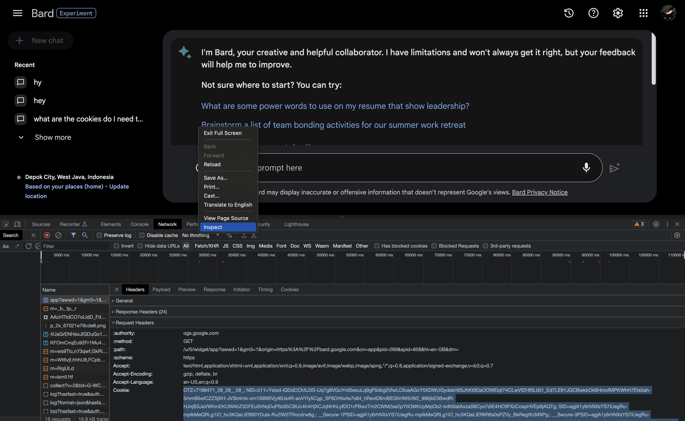

# 💬 Google Bard Assistant Obsidian

Bard assistant by Google to help you study and taking notes, and memorise materials easier! It's totally free unlike ChatGPT, and it can also shows images, and you are able to copy the responses to be moved into your notes!

_Tips! You can show the Chat view from command, by pressing `⌘` and `P` and just type in `Open Google Bard Assistant`_

## Obtaining Authentication

1. Log in to your Google account, and visit [Google Bard](https://bard.google.com)
2. Open the Web Inspector, and go to the "Network" tab.
3. Click open the first item on networks list or look for `:authority:` named `bard.google.com` or `ogs.google.com`.
4. Under request headers, look for `Cookie` and copy the whole content.

</img>

That's it! Now, put `Google Bard Key` in the Google Bard Assistant settings and you're all good!

# Features

-   [x] Chat (Obviously)
-   [x] Attach Image On the Chat
-   [ ] Editor Commands
    -   [ ] Emojify
    -   [ ] Change Tone
-   [ ] Smart Connection

More features are coming up!

# Contribute

Feel free to contribute at https://github.com/Aldhanekaa/GoogleBardObsidian, this repo is open for pull request to add more functionality, and yes credits will be added to README.

---

Made with ❤️ by [Aldhaneka](https://github.com/aldhanekaa)
